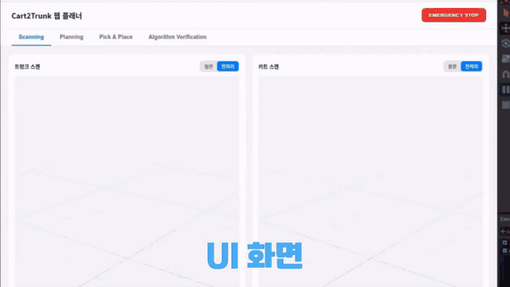
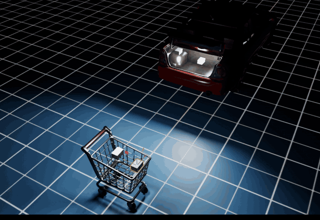
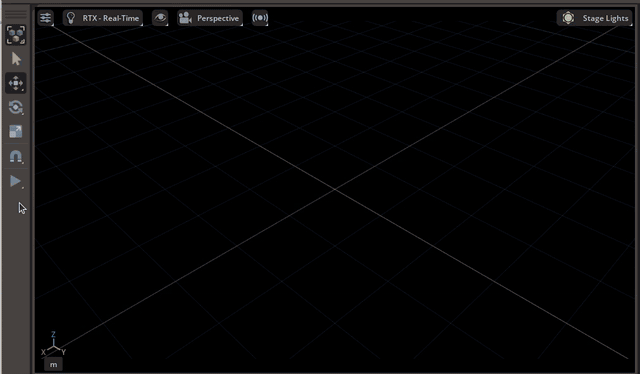
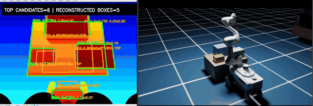
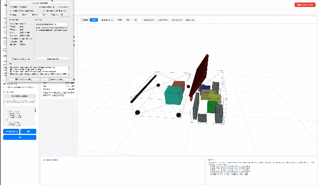
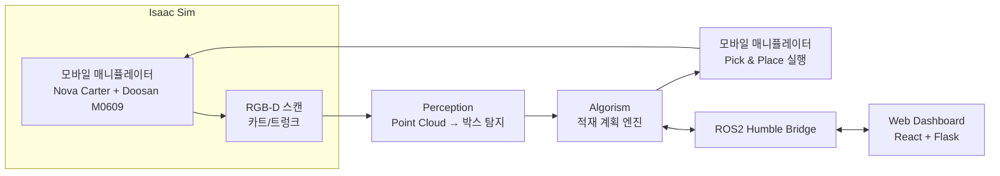

# Cart2Trunk

쇼핑카트에 담긴 물품을 RGB-D로 스캔하고, 차량 트렁크의 남은 공간을 분석해서, 모바일 매니퓰레이터가 자동으로 최적의 위치에 적재하는 **NVIDIA Isaac Sim 기반 자율 적재 시뮬레이션 프로젝트**입니다. ROS2 Humble 기반으로 시뮬레이션·적재 알고리즘·웹 대시보드가 하나의 파이프라인으로 연결되어 있습니다.

> 2026 ROKEY Cooperation3 EDU 과정 팀 프로젝트

## 데모

<p align="center">
  <a href="docs/media/cart2trunk_final_demo.mp4">
    
  </a>
</p>

<p align="center">
  <b>카트·트렁크 스캔 → 적재 계획 → 모바일 매니퓰레이터 Pick & Place → 웹 대시보드 검증</b><br/>
  <sub>이미지를 클릭하면 전체 시연 영상을 볼 수 있습니다.</sub>
</p>

### 기능별 검증

<table>
  <tr>
    <th width="50%">SDF 기반 비정형 메쉬 콜리전</th>
    <th width="50%">모바일 매니퓰레이터 Pick & Place</th>
  </tr>
  <tr>
    <td align="center">
      <a href="docs/media/sdf_collision_source.mp4">
        
      </a>
    </td>
    <td align="center">
      <a href="docs/media/mobile_manipulator_pick_place_source.mp4">
        
      </a>
    </td>
  </tr>
  <tr>
    <td align="center"><sub>카트·차량의 오목한 내부 형상을 SDF 충돌체로 적용</sub></td>
    <td align="center"><sub>Nova Carter + M0609 + VGP20 결합 모델의 집기·운반 검증</sub></td>
  </tr>
  <tr>
    <th>RGB-D Box Scan</th>
    <th>웹 대시보드 및 3D 적재 결과</th>
  </tr>
  <tr>
    <td align="center">
      <a href="docs/media/box_scan_source.mp4">
        
      </a>
    </td>
    <td align="center">
      <a href="docs/media/web_dashboard_preview.mp4">
        
      </a>
    </td>
  </tr>
  <tr>
    <td align="center"><sub>다중 시점 RGB-D 스캔과 박스 3D 복원 결과 확인</sub></td>
    <td align="center"><sub>Point Cloud·적재 계획·공간 활용률을 웹에서 시각화</sub></td>
  </tr>
</table>

## 왜 만들었나

마트에서 산 물건을 차 트렁크에 옮겨 싣는 과정은 흔하지만, 트렁크 공간을 눈대중으로 판단하고 물건을 하나씩 손으로 배치하는 반복 노동입니다. Cart2Trunk는 이 과정을 로봇이 대신하도록 하는 MVP를 시뮬레이션으로 검증합니다: **인식(무엇이 있는가) → 계획(어디에 넣을 것인가) → 실행(어떻게 옮길 것인가)** 세 단계를 모두 갖춘 엔드투엔드 파이프라인입니다.

## 시스템 아키텍처



1. **인식 (Perception)** — M0609 손목의 RGB-D 카메라로 카트/트렁크를 다중 시점 스캔 → Point Cloud → RANSAC/DBSCAN 기반 박스 탐지(위치·크기 추정) 및 트렁크 점유맵(occupancy map) 생성
2. **계획 (Algorism)** — Extreme-Point 기반 배치 알고리즘이 박스 크기·트렁크 여유 공간·장애물을 고려해 적재 순서와 위치를 계산 (여백/안전 마진, 회전, 상단 여유 공간, 적재 가능성 검증까지 포함)
3. **실행 (Execution)** — Nova Carter(홀로노믹 베이스) + Doosan M0609(6축 매니퓰레이터, 흡착 그리퍼)가 계획된 위치로 이동해 실제 Pick & Place 수행
4. **연결 (ROS2 / Web)** — 스캔 결과·적재 계획·로봇 상태를 ROS2 액션/서비스로 주고받고, 웹 대시보드에서 3D 뷰어와 함께 전체 과정을 모니터링·승인

## 핵심 기능

- **비정형 3D 메쉬 콜리전**: Sketchfab 무료 에셋(카트/트렁크)의 오목한 내부 형상을 SDF(Signed Distance Field) 콜리전으로 그대로 반영 — 손으로 측정한 박스 프록시 없이도 카트 바구니·트렁크 휠하우스 굴곡을 정확히 따름
- **모바일 매니퓰레이터 결합**: Nova Carter(차동/홀로노믹 구동 AMR)와 Doosan M0609를 하나의 PhysX Articulation으로 병합, RMPflow 기반 IK로 실제 이동+집기+놓기 수행
- **카트 양방향 접근 설계**: 트렁크 쪽 IK 해(solution branch)와 카트 손잡이 회피가 동시에 만족되지 않는 문제를, 카트를 90° 회전시켜 "어느 쪽에서 접근할지"를 독립 변수로 분리해 해결
- **적재 알고리즘(algorism/)**: Point Cloud 스캔 결과만으로 동작하는 순수 Python 배치 엔진 — 후보 생성 → 유효성 검사(여백/지지면/상부 여유 공간) → 점수화 → 적재 순서 결정 → 재스캔 시 재계획까지, pytest로 검증(35개 테스트)
- **웹 대시보드**: React(Three.js 3D 뷰어) + Flask 백엔드로 스캔 결과 확인, 적재 계획 파라미터 조정, Pick & Place 진행 상황을 실시간으로 시각화
- **ROS2 Humble 연동**: 트렁크 스캔/카트 스캔/Pick & Place를 액션(Action)으로, 적재 계획 전달을 서비스(Service)로 노출해 시뮬레이션·알고리즘·웹이 서로 다른 프로세스에서도 통신

## 기술 스택

| 영역 | 기술 |
|---|---|
| 시뮬레이션 | NVIDIA Isaac Sim 5.1 (Nova Carter, Doosan M0609 + OnRobot RG2 / VGP20 흡착 그리퍼) |
| 인식 | Open3D (RANSAC/DBSCAN), RGB-D Point Cloud |
| 적재 알고리즘 | 순수 Python, pytest |
| 로봇 미들웨어 | ROS2 Humble (Action/Service/Topic) |
| 웹 백엔드 | Flask, flask-cors |
| 웹 프론트엔드 | React 18, Vite, Three.js / @react-three/fiber |

## 리포지토리 구조

```
isaacpjt/
├── Cart2Trunk/                  # 메인 프로젝트
│   ├── 1~100.*.py                # Isaac Sim 시나리오 스크립트 (진행 단계별, 번호 순)
│   ├── algorism/                 # 적재 계획 알고리즘 (순수 Python + pytest)
│   ├── perception/                # RGB-D 스캔 → Point Cloud → 박스/점유맵 추출
│   ├── web/
│   │   ├── backend/               # Flask API
│   │   ├── frontend/               # React 대시보드
│   │   └── ros_bridge/             # 웹 ↔ ROS2 연결 스크립트
│   └── assets/                    # 카트/차량 3D 에셋 (Sketchfab CC-BY)
├── ros2_ws/                       # ROS2 Humble 패키지 (cart2trunk_bridge, cart2trunk_interfaces)
└── M0609/                        # Doosan M0609 매니퓰레이터 기초 학습 스크립트
```

## 시작하기

### Isaac Sim 시나리오 실행

```bash
# 최신 데모: 카트 양방향 접근 → 스캔 → Pick & Place → 트렁크 적재
cd isaacpjt/Cart2Trunk
isaac_python 99.cart_scan_dual_side_holonomic.py     # 카트/트렁크 스캔
isaac_python 100.cart_to_trunk_dual_side_holonomic.py # 적재 실행
```

### 적재 알고리즘 단독 실행 / 테스트

```bash
cd isaacpjt/Cart2Trunk/algorism
pytest tests/
python3 14_run_full_pipeline.py --trunk-map <trunk_map.json> --boxes <boxes.json>
```

### 웹 대시보드

```bash
# 백엔드
cd isaacpjt/Cart2Trunk/web/backend
source venv/bin/activate
python app.py                # http://localhost:5000

# 프론트엔드
cd isaacpjt/Cart2Trunk/web/frontend
npm install && npm run dev   # http://localhost:5173
```

## 현재 상태

- [x] 카트/차량(트렁크) 에셋 배치 및 SDF 콜리전
- [x] 박스 3종 + 환경 구역(존) 정의
- [x] Nova Carter + M0609 모바일 매니퓰레이터 결합 및 구동
- [x] RGB-D 스캔 → Point Cloud → 박스/트렁크 점유맵 추출
- [x] 적재 계획 알고리즘 (여백, 회전, 상부 여유 공간, 재계획 포함)
- [x] 카트 → 트렁크 Pick & Place 엔드투엔드 데모 (양방향 접근 지원)
- [x] ROS2 Humble Action/Service 브릿지
- [x] 웹 대시보드 (3D 뷰어, 계획 파라미터 조정, 진행 상황 모니터링)
- [ ] 실물 로봇 연동 검증
- [ ] 다중 물품(5개 초과) / 비정형 물체 대응

## 자산 라이선스

`Cart2Trunk/assets/`의 쇼핑카트("Metal Shopping Cart")와 트렁크 열림 차량("Lexus IS300 Trunk Open") 3D 모델은 [Sketchfab](https://sketchfab.com)에서 CC-BY 라이선스로 배포된 에셋입니다.
