# 적재 알고리즘 발전 기록 — 손그림 기반 반복 테스트 (2026-07-21 ~ 07-22)

> 노션 업로드용 정리 문서. 손그림으로 시나리오를 던지고 → 우리 알고리즘으로 직접
> 돌려보고 → 결과가 이상하면 원인을 진단해서 코드를 고치고 → 다시 돌려서 증명하는
> 과정을 라운드별로 정리했다. 손그림 원본 이미지 자체는 대화 중에만 첨부돼서
> 저장소에 파일로 남아있지 않고, **알고리즘이 실제로 만들어낸 결과 이미지**는 전부
> `isaacpjt/Cart2Trunk/algorism/local_test_data/`에 저장돼 있다 (아래 각 라운드에 파일명 표기).

## 한눈에 보기

| # | 라운드 | 트리거 | 핵심 발견 | 수정 파일 |
|---|---|---|---|---|
| 1 | 적층 가능 여부 질문 | 대화("박스 위에 박스 쌓을 수 있어?") | 받침(지지) 확인 로직이 아예 없음 | `13_support_check.py` (신규) |
| 2 | 실제 PDF 데이터 비교 | 팀 PDF + 실제 스캔 데이터 | 우리 알고리즘과 팀 스크립트가 다른 자리를 고름 (다른 목적함수) | `local_test_data/manual_placement_test.py` (신규) |
| 3 | 첫 손그림 (트렁크+차바퀴+초록 3개) | 사용자 손그림 | 다 입구 쪽에 몰려 쌓임 | `local_test_data/sketch_placement_test.py` (신규) |
| 4 | 입구 문제 진단 | 3번 결과 분석 | 로컬 원점이 입구 쪽이라 항상 거기부터 채움 | `02_trunk_space_state.py`, `05_candidate_scoring.py` |
| 5 | 로봇 원점 정정 손그림 | 사용자 손그림 (로봇 위치=원점, 고정 접근축) | y축은 입구와 무관 (x축만 봐야 함) — 첫 수정이 버그였음 | `02_trunk_space_state.py`, `05_candidate_scoring.py` |
| 6 | 벽 A/B/C 우선순위 손그림 | 사용자 손그림 (벽별 점수 지정) | 벽마다 다른 가중치로 우대하는 아이디어 | `05_candidate_scoring.py` |
| 7 | 가중치 재조정 + 후보 누락 (Green_Wide) | 6번 결과 검토 | "닿기만 하면" 보너스가 "더 깊이"를 이겨버림 + 벽에 딱 붙는 후보 자체가 누락되는 경우 발견 | `05_candidate_scoring.py`, `03_extreme_point_candidates.py`, `07_placement_plan.py` |
| 8 | 지완 전달용 코드 | 실제 비전 JSON 샘플 확인 | 박스 좌표계가 카메라 기준이라 트렁크(base frame)와 안 맞음 | `01_object3d_schema.py`, `14_run_full_pipeline.py` (신규) |
| 9 | 2층 적재 손그림 | 사용자 손그림 (초록 1층 + 파랑 2층) | `allow_stacking` 실전 테스트 성공, 장애물 위 적재라는 한계 발견 | `local_test_data/sketch_placement_test_2layer.py` (신규) |
| 10 | 카트 재적재 손그림 | 사용자 손그림 (카트+기존 트렁크) | "기존 유지+추가"보다 "전부 재조합"이 더 나은 배치를 냄 | `local_test_data/sketch_placement_test_cart_reload.py` (신규) |
| 11 | 거의 꽉 찬 트렁크 손그림 | 사용자 손그림 (스트레스 테스트) | 31.8% 찬 상태에서도 카트 박스 전부 성공 | `local_test_data/sketch_placement_test_near_full.py` (신규) |
| 12 | F_BigLeft 위치 질문 | 11번 결과에 대한 사용자 질문 | "다른 박스 옆면에 붙는 자리" 후보 누락 (7번과 같은 종류, 다른 패턴) + 부수 발견: `is_candidate_valid()`가 좌표 하한(x<0 등)을 한 번도 검사 안 했던 별개의 버그 | `03_extreme_point_candidates.py`, `04_candidate_validity_check.py`, `07_placement_plan.py` |
| 13 | 로봇 팔 천장 충돌 이미지 | 사용자 제공 이미지 (팔이 트렁크 천장에 걸림) | 상단 여유 공간(Overhead Clearance) 확인 로직이 아예 없음 - 로봇 미연결 상태에서 사전 대비 | `15_overhead_clearance_check.py` (신규), `07_placement_plan.py` |
| 14 | 카트 2층 적재 순서 질문 | 사용자 질문("위 박스부터 집는 게 맞는지 숫자로 보고 싶다") | `decide_loading_order()`가 픽업 물리 제약을 무시하고 순수 부피순 - 바닥에 깔린 박스가 1번으로 나오는 실제 버그 재현 | `03_extreme_point_candidates.py`, `06_loading_order_decision.py`, `01_object3d_schema.py` |
| 15 | 데모 스크립트 동기화 확인 | 13번 반영 여부 점검 요청 | 로컬 데모 3개가 ⑮뿐 아니라 7번(`generate_box_flush_candidates`)까지 이중으로 안 맞춰져 있던 드리프트 발견 | `local_test_data/sketch_placement_test_2layer.py`, `sketch_placement_test_cart_reload.py`, `sketch_placement_test_near_full.py` |
| 16 | "기존 박스도 재배치한 거 아니야?" 질문 | 카트 재적재 결과에 대한 사용자의 날카로운 지적 | 10번 라운드의 "전부 재조합" 방식이 사실 이미 트렁크에 있는 박스까지 알고리즘으로 다시 계산하고 있었음 - "이미 있는 짐은 못 옮긴다"는 현실 제약 반영 필요 | `local_test_data/sketch_placement_test_cart_reload.py` |
| 17 | "내가 직접 좌표 조정하고 싶다" 요청 | 손그림 좌표 재현이 어긋난다는 지적 | matplotlib 인터랙티브 3D 편집기(슬라이더+박스 추가/색상) 신규 제작, JSON 저장 → 메인 스크립트 자동 반영 연동 | `local_test_data/interactive_cart_reload_editor.py` (신규) |
| 18 | 새 장애물 손그림 (빨간 장애물 2개) | 사용자 제공 손그림 + "빈 공간에 먼저 내려놓고 나중에 재배치해도 되지 않아?" 제안 | 스테이징(임시 배치)+재배치 2-pass 로직 구현 중, 임시 박스 위에 다른 박스가 쌓였다가 붕 뜨는 물리적으로 불가능한 결과를 자체 발견·수정 | `local_test_data/sketch_placement_test_obstacles.py` (신규) |
| 19 | 회전(rotation) 지원 여부 질문 | 사용자 질문("정자세로 안 들어가면 회전시켜서 적재하기도 하나?") | 기존에 이미 "회전 미고려(MVP 범위)"로 명시돼 있던 한계를 재확인 - 코드 변경 없음 | 없음 (기존 한계 재확인) |
| 20 | 안전장치 테스트 1/4 - ⑯ 실제 차단 | 사용자 요청(⑥⑬⑮⑯을 순서대로 직접 테스트하고 싶다) | ⑯이 실제로 후보를 거부하는 사례를 처음으로 확인 - 목표 자리 자체는 여유가 있어도, 입구 쪽 더 높은 장애물 때문에 거부되고 안전한 다른 자리로 우회 배치됨 | `local_test_data/sketch_placement_test_scenario1_blocked_path.py` (신규), `local_test_data/_viz_helpers.py` (신규, 공용 시각화 헬퍼로 리팩터링) |
| 21 | 안전장치 테스트 2/4 - 3단 쌓기 체인 | 사용자 요청 | ⑥ 픽업 순서는 정확(C→B→A)했지만 트렁크 배치는 카트의 탑 구조를 그대로 재현하지 않음(16번 원칙 재확인) + 데모 재배치 로직의 실제 버그(이중 등록으로 받침 비율이 부풀려져 기준 미달 후보가 통과) 발견·수정 + before 그림이 카트 안 실제 적재 관계를 안 보여주던 시각화 버그도 수정 | `local_test_data/sketch_placement_test_scenario2_three_tier_chain.py` (신규), `local_test_data/sketch_placement_test_obstacles.py` (버그 수정), `local_test_data/_viz_helpers.py` (`stack_on_id` 추가) |
| 22 | 안전장치 테스트 3/4 - 회전 필요한 박스 | 사용자 요청 | 정자세로는 트렁크 폭보다 큰 박스가 실제로 미적재(SIZE_EXCEEDS_TRUNK) 처리되는 걸 숫자로 확인 - 이 시점엔 아직 회전 미지원이라 참고용 "회전했다면" 시험 배치만 별도로 보여줌 (26번에서 실제 자동 회전으로 해결됨) | `local_test_data/sketch_placement_test_scenario3_needs_rotation.py` (신규) |
| 23 | 안전장치 테스트 4/4 - 완전 만석 트렁크 | 사용자 요청 | 트렁크를 장애물 2개로 65% 채운 뒤 카트 박스 4개를 시도 - 성공 1개 + ⑧의 미적재 사유 3가지(SIZE_EXCEEDS_TRUNK/INSUFFICIENT_REMAINING_VOLUME/NO_VALID_CANDIDATE_POSITION)가 한 시나리오에서 전부 정확히 구분되는 것을 처음 시도에서 확인 | `local_test_data/sketch_placement_test_scenario4_full_trunk.py` (신규) |
| 24 | 박스-벽/박스-박스 마진(⑰) 추가 | 사용자 요청("박스끼리 딱 붙지 말고 여유를 두자", 1cm, 벽/박스 둘 다) | 검사만 넣으면 벽/박스에 붙는 자리 자체가 하나도 안 나와서 후보 생성도 같이 고쳐야 했음 + "벽 마진 자리가 하필 다른 박스와는 마진 미달"인 조합을 못 찾는 후보 누락 버그 발견·수정 + `12_verify_real_coords.py` 브루트포스 검증기가 이미 배치된 카트 박스를 빼먹고 세던 기존 버그까지 같이 발견·수정 | `17_margin_check.py` (신규), `03_extreme_point_candidates.py`, `07_placement_plan.py`, `10_verification.py`, `12_verify_real_coords.py` |
| 25 | 마진 실측 데모 | 사용자 요청(시나리오 5) | 빈 트렁크에 박스 4개를 순서대로 배치해서 벽 간격·박스 간 간격을 전부 직접 계산 - 여러 쌍이 정확히 1.00cm 경계값에 걸려있어서 마진이 느슨하지 않고 최소치로 빡빡하게 지켜지고 있음을 확인 | `local_test_data/sketch_placement_test_scenario5_margin.py` (신규) |
| 26 | 회전(⑱) 자동 적용 | 사용자 요청("회전시키는 알고리즘도 추가하자", 돌리기만 가능·눕히기/뒤집기 불가) | 정자세 실패 시 자동으로 90도 회전 재시도 - 실제 스캔 데이터(`run_20260720_200104`)에서 그동안 미적재였던 Medium 박스가 회전으로 정상 배치되는 실질적 개선 확인 + 데모 동기화 중 24번 마진 작업에서 빠뜨렸던 버그(후보 생성에 margin 파라미터 미전달)까지 같이 발견·수정 (`near_full` 데모 4/5 → 5/5 회복) | `18_rotation.py` (신규), `07_placement_plan.py`, `08_unloadable_reason.py`, 데모 스크립트 5개 |

---

## 1. 적층(2층 쌓기) 가능 여부 — 받침 확인 로직 부재 발견

**계기**: "지금 알고리즘으로 박스 위에 박스도 쌓을 수 있어?"라는 질문.

**발견한 문제**: 좌표 구조는 이미 3D였지만, 후보 유효성 검사(`04_candidate_validity_check.py`)가 "겹침"과 "트렁크 경계"만 확인하고 **"이 자리 밑에 받쳐주는 게 있는가"는 전혀 안 물어봤음**. 작은 박스(0.2×0.2×0.3) 위에 훨씬 큰 박스(0.6×0.6×0.2)를 놓아도 "문제없음"으로 판단되는 것을 실증.

**수정 파일**: `13_support_check.py` (신규)

```python
# 13_support_check.py:45
def compute_support_ratio(x, y, z, box, placed):
    if z < 1e-9:
        return 1.0
    x0, x1 = x, x + box.width
    y0, y1 = y, y + box.depth
    footprint_area = box.width * box.depth
    supported_area = 0.0
    for p in placed:
        if abs(p.z_range[1] - z) > 1e-9:
            continue
        px0, px1 = p.x_range
        py0, py1 = p.y_range
        overlap_x = max(0.0, min(x1, px1) - max(x0, px0))
        overlap_y = max(0.0, min(y1, py1) - max(y0, py0))
        supported_area += overlap_x * overlap_y
    return min(supported_area / footprint_area, 1.0)

# 13_support_check.py:75
def is_candidate_valid_with_stacking(x, y, z, box, trunk, placed,
                                      allow_stacking=False, min_support_ratio=0.8):
    if not is_candidate_valid(x, y, z, box, trunk, placed):
        return False
    if z < 1e-9:
        return True
    if not allow_stacking:
        return False
    return compute_support_ratio(x, y, z, box, placed) >= min_support_ratio - 1e-9
```

`07_placement_plan.py`에 `allow_stacking` 플래그로 연결 (기본값 `False` — 실제로 켜지기
전까진 지금의 1층 전용 동작을 100% 보존).

**검증**: TDD 5케이스, `10_verification.py` 5/5, 실제 데이터 미적재 0건 유지.

---

## 2. 실제 PDF 데이터로 비교 — 목적함수 차이 확인

**계기**: 팀 PDF(`15.check_fit_3d.py` 결과물)에 나온 "박스가 어디 들어가는지" 이미지를
주면서 "우리 알고리즘이면 어디에 배치될까?" 질문.

**발견한 사실**: 같은 트렁크·같은 장애물 5개에 대해, 팀 스크립트는 열린 공간에
배치했지만 우리 알고리즘은 **왼쪽 벽에 붙고 작은 장애물 위쪽 면에도 맞닿는 구석
자리**를 골랐음 (접촉면 3/6). 둘 다 "틀린" 게 아니라 최적화 기준 자체가 다름
(우리는 "구석에 파묻히기" 우선).

**결과 파일**: `local_test_data/manual_placement_test.py` (신규)
**결과 이미지**: `local_test_data/our_algorithm_placement_200104.png`

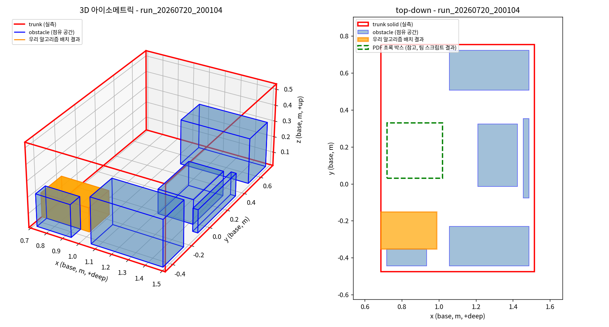

---

## 3. 첫 손그림 — 입구가 막히는 문제 발견

**계기**: 사용자가 손그림으로 트렁크(차 바퀴 2개 + 초록 박스 3개)를 그려서 전달,
"우리 알고리즘이면 어디에 배치될까?" 질문.

**발견한 문제**: 3개 박스 전부 **입구 쪽 구석에 몰려서 쌓임**. 실제 트렁크 운영
관점에서 "안쪽부터 채워야 다음 짐 넣을 때 편한데, 입구부터 막아버리는" 비현실적인
결과.

**결과 파일**: `local_test_data/sketch_placement_test.py` (신규)

> ⚠️ 이 라운드의 결과 이미지(`sketch_placement_result.png`)는 이후 6번·7번 라운드에서
> **같은 파일 이름으로 재실행하면서 덮어써져서, "입구에 몰린" 당시 화면은 더 이상
> 파일로 안 남아있다.** 최종적으로 이 파일에 남아있는 건 7번 라운드의 결과 화면이다
> (아래 7번 항목에서 확인 가능).

---

## 4. 입구 문제 원인 진단 + 1차 수정 (이후 5번에서 버그로 판명)

**진단**: `to_bounding_trunk()`가 트렁크 점들 중 최솟값을 그냥 로컬 `(0,0,0)`으로
잡는데, 극점 알고리즘은 항상 그 원점부터 채워나가는 구조. 실제 데이터로 확인해보니
이 원점이 로봇(입구)에서 제일 가까운 코너였음 — 우연이 아니라 구조적 문제.

**1차 수정**: 원점 자체는 안 건드리고 (로봇 제어 좌표 변환이 이미 이 원점 기준),
스코어링에 "입구에서 먼 정도" 항을 추가.

```python
# 02_trunk_space_state.py:55 (Trunk 필드 추가)
entrance_near_x: bool = True
entrance_near_y: bool = True   # (5번에서 제거됨 - 버그였음)
```

```python
# 05_candidate_scoring.py (당시 버전 - x/y 평균, 5번에서 수정됨)
def entrance_distance_ratio(x, y, box, trunk):
    depth_x = x if trunk.entrance_near_x else (trunk.width - (x + box.width))
    depth_y = y if trunk.entrance_near_y else (trunk.depth - (y + box.depth))
    return ((depth_x / trunk.width) + (depth_y / trunk.depth)) / 2
```

**검증**: TDD 4케이스, 전체 회귀 통과.

---

## 5. 로봇 원점 정정 손그림 — x/y 평균이 버그였음을 발견

**계기**: 사용자가 손그림 2장으로 "로봇 원점은 트렁크 기준 왼쪽 **중앙**에서 오고,
로봇은 항상 정해진 한 방향(고정된 화살표)으로만 접근한다"를 직접 지정.

**발견한 문제**: 4번의 수정이 x/y 둘 다 평균 내는 방식이었는데, **y(좌우 위치)는
입구와 아예 무관**하다는 게 손그림으로 명확해짐 — 로봇은 한 축으로만 접근하므로
좌우 위치가 달라도 입구에서 먼 정도는 같아야 하는데, 평균을 내다보니 y만 달라도
점수가 달라지는 실제 버그였음.

**수정**: `entrance_near_y` 필드 완전 제거, x축만 사용.

```python
# 05_candidate_scoring.py:109
def entrance_distance_ratio(x: float, box: "Box", trunk) -> float:
    depth_x = x if trunk.entrance_near_x else (trunk.width - (x + box.width))
    return depth_x / trunk.width
```

시각화에도 로봇을 트렁크와 분리된 점 + 접근 화살표로 명시 (`local_test_data/sketch_placement_test.py`
갱신, `ROBOT_Y = TRUNK_DEPTH / 2`).

**검증**: `tests/test_05_candidate_scoring.py::test_lateral_y_position_does_not_affect_score`로
같은 x, 다른 y가 완전히 같은 점수를 받는지 회귀 방지. 전체 pytest 13/13.

---

## 6. 벽 A/B/C 우선순위 손그림

**계기**: 사용자가 손그림으로 벽 3개에 이름을 붙임 — A(가장 안쪽, 입구 반대편,
최우선) > B/C(양쪽 측면, 그다음 우선, 서로 동일).

**수정**: `ENTRANCE_WEIGHT`를 `WALL_A_WEIGHT`로 개명(같은 로직), 측면 벽용
`side_wall_distance_ratio()` + `WALL_BC_WEIGHT` 신규 추가.

```python
# 05_candidate_scoring.py:129
def side_wall_distance_ratio(y: float, box: "Box", trunk) -> float:
    dist_to_c = y
    dist_to_b = trunk.depth - (y + box.depth)
    nearest_wall_dist = min(dist_to_c, dist_to_b)
    max_possible = (trunk.depth - box.depth) / 2
    if max_possible < 1e-9:
        return 0.0
    return min(nearest_wall_dist / max_possible, 1.0)
```

이 라운드에서도 같은 파일(`sketch_placement_result.png`)로 다시 렌더링했지만, 이
버전도 7번 라운드에서 다시 덮어써져서 별도로는 안 남아있다 (아래 7번 최종본 참고).

---

## 7. 가중치 재조정 + 벽-밀착 후보 누락 발견 (Green_Wide 사례)

**계기**: 6번 결과 검토 중 사용자가 "지금은 벽에 붙는 걸 기준으로 점수를 주니까
양쪽 사이드로 빠지는 것 같다"고 지적.

**문제 1 - 가중치**: `WALL_BC_WEIGHT`의 "완전히 붙었을 때" 보너스가 `WALL_A_WEIGHT`로
얻는 "조금 더 깊이" 이득보다 커서, 박스가 얕은 채로 아무 옆벽에나 안주함.

```python
# 05_candidate_scoring.py:53-54
WALL_A_WEIGHT = 0.9   # 이전 0.6
WALL_BC_WEIGHT = 0.2  # 이전 0.3
```

**문제 2 - 후보 생성 누락**: 폭 0.28m 박스가 물리적으로 들어갈 수 있는 "벽 A에 딱
붙는 자리"(x=0.32)가 있었는데도, 그 좌표를 만들어줄 기존 모서리가 우연히 없어서
후보 자체가 안 생겼음 (`(0.32, 0.31, 0)`이 `is_candidate_valid`엔 통과하는데
`state.candidates`엔 없었음을 실증).

```python
# 03_extreme_point_candidates.py:134
def generate_wall_flush_candidates(box: Box, trunk, candidates) -> Set[Tuple[float, float, float]]:
    extra: Set[Tuple[float, float, float]] = set()
    wall_a_x = (trunk.width - box.width) if trunk.entrance_near_x else 0.0
    wall_c_y = 0.0
    wall_b_y = trunk.depth - box.depth
    for (x, y, z) in candidates:
        extra.add((wall_a_x, y, z))
        extra.add((x, wall_c_y, z))
        extra.add((x, wall_b_y, z))
    return extra
```

`07_placement_plan.py::place_one_box()`에서 `state.candidates | generate_wall_flush_candidates(...)`로
후보 풀에 병합.

**부수 효과**: 기존 "pocket vs open" 회귀 데모(`05_candidate_scoring.py`,
`10_verification.py`)가 우연히 정중앙에 걸려서 깨짐 → 좌표 재설계로 해결
(`A(8,1) B(8,3) C(10,1)`, `pocket=(10,3)`, `open=(1,1)`).

**검증**: TDD 3케이스(`tests/test_wall_flush_candidates.py`), 전체 pytest 20/20.

**결과 이미지 (최종본 — 3번·6번의 같은 파일을 최종적으로 덮어쓴 버전)**: `local_test_data/sketch_placement_result.png`

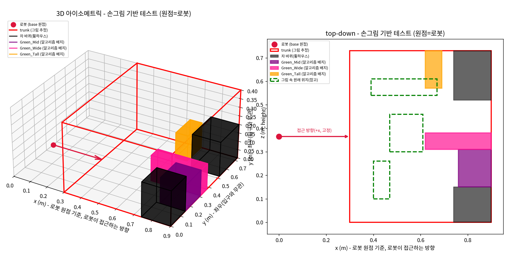

---

## 8. 지완 전달용 코드 — 실제 비전 데이터 좌표계 불일치 발견

**계기**: "지완님 컴퓨터에서 우리 알고리즘 실행하려면 뭘 보내야 해?" 질문. 실제
박스 비전 샘플(`all_boxes_corners_20260721_174311_555644.json`)을 직접 열어봄.

**발견한 문제**: 박스 데이터가 `center_xyz`/`size_xyz`가 아니라 8개 모서리 좌표로
오고, **좌표계가 `depth_camera_optical_frame_from_message_header`(카메라 기준)**였음
— 트렁크 데이터(`trunk_map.json`)는 이미 `m0609_base_link`(로봇 base)로 나오는데
박스는 그 변환 전 단계. 그대로 섞으면 엉뚱한 자리에 배치됨.

**수정**: 좌표계 검증을 넣어 안전장치 마련 + 실제 8모서리 → AABB 변환 로더 신규.

```python
# 01_object3d_schema.py:54
EXPECTED_BOX_FRAME = "m0609_base_link"

# 01_object3d_schema.py:96
def load_boxes_from_vision_json(path) -> List[Object3D]:
    data = json.loads(Path(path).read_text())
    frame = data.get("coordinate_frame")
    if frame != EXPECTED_BOX_FRAME:
        raise ValueError(
            f"박스 비전 데이터의 좌표계가 '{frame}'인데 '{EXPECTED_BOX_FRAME}'이어야 함 - "
            f"트렁크 데이터와 같은 좌표계로 맞춰서 다시 내보내달라고 요청해야 함"
        )
    # ... corners_m 8개 점 min/max로 AABB 근사 (② to_bounding_trunk()와 같은 방식)
```

`14_run_full_pipeline.py` (신규) — `--trunk-map`, `--boxes`, `--allow-stacking`, `--out`
CLI. 최종 좌표를 `local_to_base_frame()`으로 다시 base frame으로 변환해서 출력.

**검증**: TDD 5케이스, 실제 `trunk_map.json`으로 CLI 스모크 테스트, 카메라 좌표계
샘플 넣으면 의도대로 에러 발생 확인. 전체 pytest 25/25.

---

## 9. 2층 적재 손그림 — `allow_stacking` 실전 테스트

**계기**: 사용자가 손그림에 파란 박스 2개를 추가, "초록은 1층, 파랑은 2층에
적재해봐" 지시.

**결과**: 1층 5개 + 2층 2개 전부 성공. 다만 파란 박스 하나가 초록 박스가 아니라
**차 바퀴(휠하우스) 위**에 쌓이는 걸 발견 — 저희 받침 확인 로직이 장애물과 박스를
구분 안 해서 생긴 한계로, 실제 휠하우스는 둥글어서 이렇게 평평하게 못 얹을 수
있음을 사용자에게 고지 (아직 코드 수정 안 함, 알려진 한계로 기록만).

**결과 파일**: `local_test_data/sketch_placement_test_2layer.py` (신규,
`place_one_box_stacked_only()` 헬퍼로 z=0 후보를 배제해서 "무조건 2층" 지시를 그대로 반영)
**결과 이미지**: `local_test_data/sketch_placement_2layer_result.png`

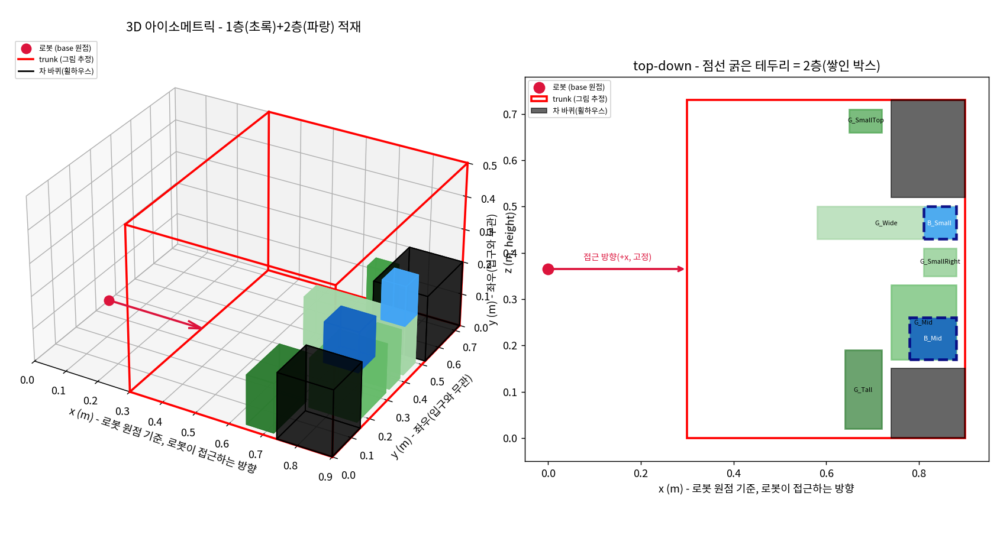

---

## 10. 카트 재적재 손그림 — "유지+추가" vs "전부 재조합"

**계기**: 사용자가 손그림에 왼쪽 쇼핑 카트(초록 1개+파랑 2개)를 추가, "이걸 트렁크에
적재해봐" 지시.

**1차 시도(수정 필요)**: 지난번 트렁크 상태(7개)를 고정해두고 카트의 새 3개만
추가 배치 → 사용자가 "그게 아니라 카트+트렁크 전부 새롭게 조합해서 계산해보라는
뜻이었다"고 정정.

**2차 시도(올바른 해석)**: 10개(1층 6개+2층 4개) 전부를 한 배치로 합쳐서 빈
트렁크부터 다시 최적화. 1차 시도 때보다 `Cart_Green`이 훨씬 좋은 자리(벽 A 바로
옆)를 차지하는 것으로 "한 번에 다 보고 정하는 게 순차 확정보다 낫다"를 실증.

**결과 파일**: `local_test_data/sketch_placement_test_cart_reload.py` (신규)
**결과 이미지**: `local_test_data/sketch_placement_cart_reload_result.png`

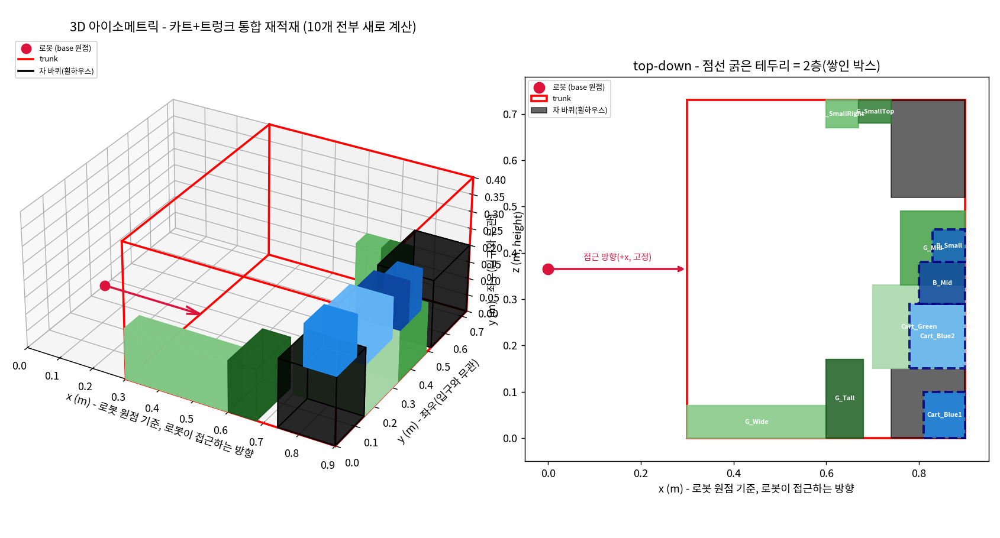

---

## 11. 거의 꽉 찬 트렁크 손그림 — 스트레스 테스트

**계기**: 사용자가 손그림으로 트렁크가 초록 박스 5개로 거의 가득 찬 상태를 그리고,
같은 카트 박스 3개(초록 1층+파랑 2층)가 그런 좁은 공간에도 잘 들어가는지 테스트
요청. 이번엔 "이미 확정된 걸 못 옮긴다"는 현실적 제약이 핵심이라 10번과 달리
"기존 고정 + 신규만 배치" 방식으로 진행.

**결과**: 바닥 31.8% 사용 상태에서도 카트 박스 3개 전부 성공 (미적재 0개) — 빈틈을
정확히 찾아 배치, 2층 박스는 기존 박스/장애물 위에 올바르게 쌓임.

**결과 파일**: `local_test_data/sketch_placement_test_near_full.py` (신규)

> ⚠️ 이 라운드의 결과 이미지도 12번 라운드에서 같은 파일 이름으로 재실행하면서
> 덮어써졌다 - 당시(수정 전) 화면은 안 남아있고, 최종본은 12번 항목에서 확인 가능.

---

## 12. F_BigLeft 위치 질문 — 박스-밀착 후보 누락 발견 및 수정

**계기**: 11번 결과에서 "`F_BigLeft`가 `F_Tall`보다 입구에 더 가까운 이유가 뭐야?
더 안쪽으로 넣을 수 있었을 것 같은데?" 질문.

**진단**: 직접 좌표를 다시 뽑아서 확인 — `F_BigLeft` 배치 시점에 바닥(z=0) 유효
후보가 딱 4개였고 전부 `x=0.000`이었음. 근데 `x=[0.20,0.38]`(먼저 놓인 `F_BigRight`
바로 옆에 딱 붙는 자리)이 물리적으로는 완전히 비어있었는데도 후보로 안 만들어짐.

**원인**: 7번에서 고친 `generate_wall_flush_candidates()`는 "트렁크 바깥쪽 벽
A/B/C"에 딱 붙는 자리만 다뤘지, **"이미 놓인 다른 박스의 옆면"**에 딱 붙는 자리는
아직 다루지 않음 — 같은 계열의 후보 생성 완전성 문제의 또 다른 패턴.

**수정**: `generate_box_flush_candidates()` 신규 추가 - 놓인 박스/장애물마다
가까운 면·먼 면에 딱 붙는 좌표를 만들어서 후보 풀에 병합.

```python
# 03_extreme_point_candidates.py
def generate_box_flush_candidates(box, trunk, candidates, placed):
    extra = set()
    for (x, y, z) in candidates:
        x0, x1 = x, x + box.width
        y0, y1 = y, y + box.depth
        z0, z1 = z, z + box.height
        for p in placed:
            px0, px1 = p.x_range
            py0, py1 = p.y_range
            pz0, pz1 = p.z_range
            if _ranges_overlap((y0, y1), (py0, py1)) and _ranges_overlap((z0, z1), (pz0, pz1)):
                extra.add((px0 - box.width, y, z))  # p 바로 앞(입구 쪽)에 붙음
                extra.add((px1, y, z))              # p를 지나 바로 뒤(안쪽)에 붙음
            if _ranges_overlap((x0, x1), (px0, px1)) and _ranges_overlap((z0, z1), (pz0, pz1)):
                extra.add((x, py0 - box.depth, z))
                extra.add((x, py1, z))
    return extra
```

**부수 발견 - 별개의 진짜 버그**: 이 함수가 생성하는 `px0 - box.width` 같은 계산은
박스 폭이 앞쪽 빈 틈보다 넓으면 음수가 나올 수 있는데, `04_candidate_validity_check.py::is_candidate_valid()`가
**트렁크 경계의 아래쪽(x<0, y<0, z<0)은 한 번도 확인한 적이 없었다**는 게 드러남
(윗쪽 경계 `x+width<=trunk.width`만 확인). 지금까지는 `register_placement()`가
만드는 후보가 항상 0에서 시작해서 이 구멍이 안 드러났을 뿐, 실제로 `y=-0.3`인
후보가 유효하다고 통과한 걸 실증. `is_candidate_valid()`에 하한 검사를 추가해서
근본 원인에서 수정 (후보 생성 쪽에서 걸러내지 않음).

**검증**: `tests/test_box_flush_candidates.py`(3케이스) + `tests/test_04_candidate_validity_check.py`(4케이스,
음수 좌표 회귀 방지) 신규. 전체 pytest 32/32. 실제 시나리오 재실행 결과 `F_BigLeft`가
차 바퀴(휠하우스) 바로 옆에 딱 붙어서 훨씬 깊이 들어가는 것으로 확인.

**결과 이미지 (수정 후 재실행)**: `local_test_data/sketch_placement_near_full_result.png` (11번과 같은 파일, 최종 갱신됨)

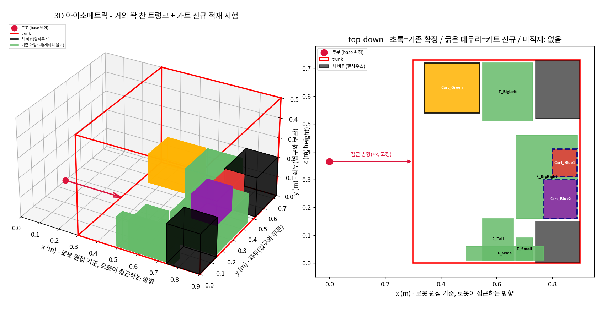

---

## 13. 로봇 팔 천장 충돌 이미지 — 상단 여유 공간(⑮) 신규 도입

**계기**: 사용자가 로봇 팔이 트렁크 천장/입구 쪽에 걸리는 사진을 공유하며 "우선
시나리오부터 짜줘" 요청. 아직 로봇을 연결해서 실제로 걸리는지 확인해본 건 아니고,
**미리 대비**하는 차원이라고 명시.

**설계 방향 확정 (대화로 조율)**: 우리 패키징 알고리즘이 실제 IK/충돌 시뮬레이션까지
하는 건 범위 밖(그건 하류의 모션 플래너 몫) — 대신 **보수적인 안전 마진**만 걸기로
합의. VGP20 그리퍼의 실측 치수를 얻으려고 USD 파일(`m0609_vgp20_camera.usd` →
`m0609_vgp20.usd`)을 여러 차례 요청해 열어봤지만, 참조하는 그리퍼 메시 파일
(`vgp20_converted.usd`)을 시스템 전체에서 못 찾음 — 공식 M0609 로봇 팔 USD는 3곳에서
찾아 실측 링크/조인트 데이터는 확보했지만, 그리퍼는 결국 보수적 추정치를 씀. 위반 시
"점수 감점"이 아니라 **완전 차단(하드 컷)** 방식으로 결정.

**수정 파일**: `15_overhead_clearance_check.py` (신규)

```python
# 15_overhead_clearance_check.py:36
OVERHEAD_CLEARANCE = 0.20

# 15_overhead_clearance_check.py:39
def has_overhead_clearance(z: float, box: "Box", trunk, clearance: float = OVERHEAD_CLEARANCE) -> bool:
    return (trunk.height - (z + box.height)) >= clearance - 1e-9
```

```python
# 07_placement_plan.py:24, 32, 74 — place_one_box() 후보 필터에 연결
_m15 = import_module("15_overhead_clearance_check")
has_overhead_clearance = _m15.has_overhead_clearance
...
valid_candidates = [
    (x, y, z) for (x, y, z) in candidate_pool
    if is_candidate_valid_with_stacking(x, y, z, box, trunk, state.placed, allow_stacking=allow_stacking)
    and has_overhead_clearance(z, box, trunk)
]
```

**사전에 잡은 회귀 (구현 전 계산으로 미리 발견, "안전하게 진행" 지시에 따름)**:
`10_verification.py`가 쓰던 `REAL_TRUNK`(높이 0.25m)로는 새 여유 기준(0.2m)까지 더하면
Small/Medium 박스조차 못 들어간다는 걸 구현 전에 계산으로 먼저 확인해서 보고 →
사용자가 "REAL_TRUNK는 임시값이니 테스트 기대값을 현실에 맞게 수정"으로 결정. 이후
실제로 발생한 회귀 2건(스태킹 테스트 트렁크 높이, `INSUFFICIENT_REMAINING_VOLUME`
케이스)도 전부 시나리오 재설계로 해결(값을 억지로 맞추지 않음).

**검증**: TDD 5케이스(`tests/test_15_overhead_clearance_check.py`), `10_verification.py`
5/5, `12_verify_real_coords.py`(실제 스캔 2건) 이상 없음.

---

## 14. 카트 2층 적재 순서 질문 — 픽업 순서 제약(⑥) 재작성

**계기**: "카트에 박스가 2층으로 적재돼 있을 때 위 박스부터 집어서 트렁크에 적재하는
게 맞는지, 순서를 숫자로 볼 수 있을까?" 라는 구체적 검증 요청.

**발견한 문제**: 팀이 7/20에 "Vision은 카메라에 지금 보이는 박스만 준다 - 밑에 깔린
건 애초에 인식이 안 되니 코드 수정 불필요"로 결론 냈었는데, 실제 비전 데이터
(`all_boxes_corners_*.json`)를 보니 `support_type`("floor"/"box_top") 필드가 있어
**깔려있는 박스도 관계 정보와 함께 한 번에 인식**하고 있었음 — 7/20 전제가 이미
깨져 있었음. 데모로 직접 재현: 초록 박스(바닥, 부피 최대) 위에 파란 박스 2개가
얹혀 있는 카트를, 그대로 순수 부피순으로 정렬하면 **밑에 깔린 초록이 1번으로
나옴** (물리적으로 불가능한 픽업 순서).

**수정**: `Box`에 `rests_on_id` 필드 추가, `decide_loading_order()`를 "지금 위에
아무것도 안 얹힌(픽업 가능한) 것들 중 부피가 큰 것부터" 고르는 위상정렬로 재작성.

```python
# 03_extreme_point_candidates.py:38
rests_on_id: Optional[str] = None  # 카트 위에서 이 박스가 다른 어떤 박스 위에 얹혀 있는지

# 06_loading_order_decision.py:38
def decide_loading_order(boxes: List["Box"]) -> List["Box"]:
    remaining = {b.id: b for b in boxes}
    order: List["Box"] = []
    while remaining:
        blocked_ids = {b.rests_on_id for b in remaining.values() if b.rests_on_id is not None}
        available = [b for b in remaining.values() if b.id not in blocked_ids]
        next_box = max(available, key=lambda b: b.volume)
        order.append(next_box)
        del remaining[next_box.id]
    return order
```

`01_object3d_schema.py`의 `Object3D`에도 같은 필드를 추가하고 `object3d_to_box()`가
끊기지 않게 그대로 전달하도록 함(실제 비전 필드 `support_candidate_id`와의 정확한
매핑은 팀 확인 전이라 로더에서는 아직 `None`으로 안전하게 둠).

**결과 (수정 전 → 후, 실제 숫자)**:

| 순번 | 수정 전(순수 부피순) | 수정 후(픽업 순서 제약) |
|---|---|---|
| 1 | Cart_Green (5.40L, 맨 아래인데 1번) ❌ | Cart_Blue2 (2.02L) ✅ |
| 2 | Cart_Blue2 (2.02L) | Cart_Blue1 (1.08L) ✅ |
| 3 | Cart_Blue1 (1.08L) | Cart_Green (5.40L, 맨 아래라 마지막) ✅ |

**검증**: TDD 4케이스(`tests/test_06_loading_order_decision.py`, 카트 시나리오
그대로 재현하는 케이스 포함) + 2케이스(`tests/test_01_object3d_schema.py`), 전체
pytest 43/43, `10_verification.py` 5/5.

---

## 15. 데모 스크립트 동기화 확인 — 이중 드리프트 발견

**계기**: "동기화해도 핵심 알고리즘은 안전하다는 거지?"라고 먼저 확인한 뒤 진행
승인. 13번(⑮) 적용 후 로컬 데모 3개가 실제 파이프라인(`07_placement_plan.py`)과
계속 같은 로직을 쓰고 있는지 점검.

**발견한 문제**: ⑮뿐 아니라, **7번에서 고친 `generate_box_flush_candidates()`도
로컬 헬퍼 함수에 반영이 안 돼 있었음** — 즉 두 라운드 분량의 드리프트가 동시에
쌓여 있던 것. 조용히 고치지 않고 사용자에게 먼저 보고한 뒤 동기화 진행.

**수정**: `sketch_placement_test_2layer.py`, `sketch_placement_test_cart_reload.py`,
`sketch_placement_test_near_full.py` 3개 전부 `has_overhead_clearance` +
`generate_box_flush_candidates` 반영. `TRUNK_HEIGHT`도 0.40 → 0.50으로 상향
(2개 층 쌓기 + 0.2m 여유를 동시에 만족시키려면 필요).

**검증**: 3개 스크립트 전부 재실행해서 100% 배치 성공 확인, 전체 pytest 43/43.

---

## 16. "기존 박스도 재배치한 거 아니야?" — 카트 재적재 로직 재설계

**계기**: 10번 라운드 결과표를 보고 사용자가 "Cart_Green을 카트에선 마지막에
집지만 트렁크엔 가장 먼저 넣으면, 원래 있던 박스들 결국 치우고 넣어야 하는 거
아니야? 그런 것까지 계산한 거야?" 라고 정확히 지적.

**인정한 문제**: 아니었음 — 10번의 "전부 재조합" 방식은 **이미 트렁크에 있던
7개까지 매번 알고리즘으로 새로 계산**하고 있었고, "그 목표 배치에 도달하려면
기존 짐을 실제로 얼마나 옮겨야 하는지"는 전혀 반영 안 돼 있었음. 사용자가 두
선택지(①전부 다시 계산 vs ②안 움직여도 되는 건 그대로 두고 새 것만 배치) 중
"로봇으로 기존 적재물을 미는 건 지금 단계에서 어려우니, 주어진 공간에서
최선을 다하자"를 선택.

**재설계**: 기존 7개는 차 바퀴와 동일하게 **좌표를 상수로 등록만 하고
`decide_loading_order`/`place_one_box`를 아예 호출하지 않음** — 알고리즘이 그
자리를 "결정"하는 게 아니라 "주어진 사실"로 취급. 카트에서 온 3개만 ⑥+⑦ 전체
파이프라인을 적용해서 남는 공간에 배치.

**드러난 실전 결과**: 이 현실적 제약 하에서 `Cart_Blue2`가 실제로 **미적재**로
나옴 — "카트에서 집는 순서(픽업 물리 제약)"와 "트렁크에 놓을 수 있는 순서(자리
가용성)"가 다를 수 있다는 걸 실제 시나리오에서 증명한 셈(14번에서 만든 개념이
여기서 실전 충돌 사례로 나타남).

**추가 피드백 반영**: 이 상수 좌표가 처음엔 알고리즘이 다른 목적으로 계산했던
값을 그대로 가져온 것이었는데, "이 손그림을 참고해서 다시 조정해봐"라는 지적을
받고 손그림의 배치 구도(입구 쪽 작은 박스 클러스터, 그 아래 넓은 박스, 바퀴
사이 틈에 낀 큰 박스)에 맞춰 좌표를 다시 잡음.

**결과 파일**: `local_test_data/sketch_placement_test_cart_reload.py` (재작성)
**결과 이미지**: `local_test_data/sketch_placement_cart_reload_result.png`


---

## 17. "내가 직접 좌표 조정하고 싶다" — 인터랙티브 3D 편집기 제작

**계기**: 16번에서 손그림 구도를 텍스트로 설명해서 좌표를 추정하는 방식의 한계를
느낀 사용자가 "내가 직접 좌표를 수정하고 그림을 볼 수 있게, matplotlib 3d를
써서 만들어줘"라고 요청. 디스플레이(`DISPLAY=:0`, Wayland)와 GUI 백엔드(TkAgg 등)
사용 가능 여부를 먼저 확인한 뒤 실제 동작하는 GUI로 제작.

**기능**: 라디오버튼으로 박스 선택 → X/Y/Z 슬라이더로 조정하면 3D(회전 가능)와
top-down이 실시간 갱신, 다른 박스/트렁크 밖과 겹치면 빨간 테두리+경고 문구,
"저장" 버튼으로 JSON 내보내기, "초기화" 버튼. 이어서 "새 박스 추가하고 색깔도
넣을 수 있게 해줄 수 있어?" 요청을 받아 이름/가로/세로/높이/색상 입력창 +
"박스 추가" 버튼을 추가하고, 라디오버튼 목록을 동적으로 다시 생성하도록 확장.

**연동**: `sketch_placement_test_cart_reload.py`가 저장된
`cart_reload_fixed_positions.json`이 있으면 자동으로 읽어서 기존 7개 좌표에
반영(없으면 기존 하드코딩 기본값 사용) — 단, 편집기에서 직접 추가한 이름 모를
박스는 메인 스크립트가 아는 7개 id에 없으므로 자동으로 무시됨(시각화 실험용).

**결과 파일**: `local_test_data/interactive_cart_reload_editor.py` (신규, GUI 도구라
정적 결과 이미지 없음 - `python3 interactive_cart_reload_editor.py`로 직접 실행)

**검증**: 리치 JSON 포맷(위치+치수+색상) 저장/로드 왕복 테스트(알려지지 않은
커스텀 박스는 메인 스크립트가 안전하게 무시하는지 포함), 전체 pytest 43/43.

---

## 18. 새 장애물 손그림 — 스테이징+재배치, 물리적으로 불가능한 배치 자체 발견·수정

**계기**: 사용자가 새 손그림(장애물 두 개 + 카트)을 제공하고 "이걸 참고해서
적재해봐" 요청.

**1차 결과 (예상보다 심한 실패)**: 카트 박스 3개 중 **2개(Cart_Blue1, Cart_Blue2)가
미적재**. 장애물 높이가 이미 0.20m라서 그 위에 파란 박스(0.12m)를 쌓으면 남는
여유가 0.18m로 ⑮ 기준(0.20m) 미달, 그렇다고 쌓을 수 있는 유일한 곳(Cart_Green)은
픽업 순서상 아직 트렁크에 없는 시점이라 못 씀 — 16번에서 발견한 "픽업 순서 ≠
배치 가능 순서" 문제가 장애물이 큰 시나리오에서 더 심하게 재현됨.

**사용자 제안**: "파란 박스를 트렁크의 빈 공간에 둘 수 있다면 먼저 내려놓고,
Cart_Green을 배치한 다음에 다시 재배치 해도 되지 않아?"

**1차 구현의 숨은 버그 (스스로 발견)**: 곧바로 구현하니 3/3 성공으로 나왔지만,
자세히 보니 `Cart_Blue1`이 **아직 임시로 내려놓은 상태인 `Cart_Blue2` 위에**
쌓여 있었음 — 이후 3단계에서 `Cart_Blue2`가 다른 자리로 재배치되면서 `Cart_Blue1`이
받침 없이 붕 뜬 채로 남는, 물리적으로 불가능한 결과였음. "임시로 내려놓은 것 위엔
아무것도 못 쌓게" `state`(전체)와 `state_final`(확정만)을 분리해서 재구현.

```python
# local_test_data/sketch_placement_test_obstacles.py
# state_final: "다른 박스가 그 위에 안심하고 쌓여도 되는" 확정 배치만 담는다.
# 임시로 내려놓은 박스는 나중에 옮겨질 수 있으므로 여기 절대 안 넣는다.
state_final = ExtremePointState()
...
plan = place_one_box_stacked_only(box, trunk, state_final, order=order_counter)
```

수정 후, 최종 결과 전체에 대해 ⑬(`13_support_check.py`)이 실제로 쓰는 것과 **완전히
같은 기준(받침 비율 ≥80%)**으로 재검증하는 자체 안전장치도 추가(100% 완전 지지를
요구하면 ⑬보다 엄격해서 거짓 경보가 남 — 처음엔 이 실수도 했다가 바로 잡음).

**결과**: 카트 박스 3개 전부 배치 성공 (`Cart_Green` 1층, `Cart_Blue1`/`Cart_Blue2`
임시 바닥 → 2층 재배치 성공), 받침 비율 검증 통과.

**결과 파일**: `local_test_data/sketch_placement_test_obstacles.py` (신규)
**결과 이미지**: `local_test_data/sketch_placement_obstacles_result.png`

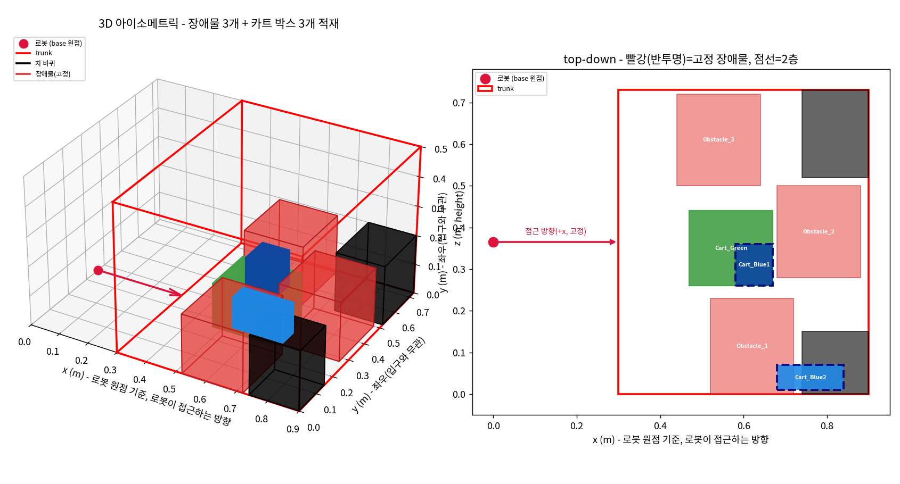

**검증**: 전체 pytest 43/43, `10_verification.py` 5/5, `12_verify_real_coords.py`
이상 없음 (핵심 알고리즘 파일은 전혀 안 건드리고 데모 스크립트 안에서만 처리).

---

## 19. 회전(rotation) 지원 여부 질문 — 기존 한계 재확인

**계기**: "박스가 정자세로 안 들어가면 회전시켜서 적재하기도 하나?" 질문.

**확인**: 코드를 새로 안 고치고 기존 코드를 그대로 확인 - `fits_dims()`와
`01_object3d_schema.py`의 비전 로더 둘 다 이미 "회전은 고려하지 않음(MVP 범위)"라고
명시돼 있었음.

```python
# 03_extreme_point_candidates.py:136
"""박스 자체 크기가 트렁크보다 큰지 여부 (회전은 고려하지 않음 - MVP 범위)."""
```

**결론**: 세워서는 안 들어가지만 눕히면(가로/세로/높이를 바꾸면) 들어가는
경우에도, 지금은 회전을 시도조차 안 하고 그냥 미적재 처리됨. 실제로 필요한
기능인지(그리퍼가 90도로 돌려 놓는 게 물리적으로 가능한지 등)는 로봇 연결 후
팀과 논의하기로 보류 - 코드 변경 없음.

---

## 20. 안전장치 테스트 1/4 — ⑯ 접근 경로 확인이 실제로 후보를 거부하는 사례

**계기**: 지금까지 만든 안전장치(⑥⑬⑮⑯)를 사용자가 직접 시나리오를 주면서 하나씩
검증해보고 싶다고 요청. "지금까지 테스트한 건 전부 ⑯이 우연히 경계값이라
통과했을 뿐, 진짜로 거부하는 걸 본 적이 없다"는 점에 착안해 첫 시나리오로 선정.

**설계**: 트렁크에 입구 쪽으로 아주 높이 솟은 장애물(`Tall_Blocker`, 높이 0.40m,
천장 0.50m의 80%)을 놓고, 그 뒤(더 깊은 곳)에 받침 박스(`Base_Box`)를 배치.
카트 박스(`Cart_Item`) 하나를 `Base_Box` 위에 쌓으려고 시도.

**결과**: ⑬(받침)과 ⑮(최종 자리 천장 여유)는 둘 다 통과하는데, **⑯이 명확히
거부**함 - `Tall_Blocker`(0.40m)를 넘어가려면 그 높이 기준으로 천장 여유를 다시
계산해야 하는데, `0.50 - (0.40 + 0.10) = 0.00m`로 기준(0.20m) 미달. 거부되고 나면
일반 배치로 재시도해서 **바닥의 다른 안전한 자리로 우회 배치 성공** - ⑯이 그냥
실패로 끝나는 게 아니라 안전한 대안으로 이어진다는 것까지 확인.

**부수 작업**: 여러 데모 스크립트가 거의 똑같이 복붙해온 3D+top-down 시각화
코드(~150줄)를 `local_test_data/_viz_helpers.py`로 뽑아내서 공용화. "비포(카트에
대기 중)/애프터(트렁크 배치 완료)" 한 쌍을 `draw_scene()` 두 번 호출로 만들 수
있게 정리 - 이후 시나리오들은 전부 이 헬퍼를 재사용.

**결과 이미지**: `local_test_data/sketch_scenario1_before.png` / `sketch_scenario1_after.png`

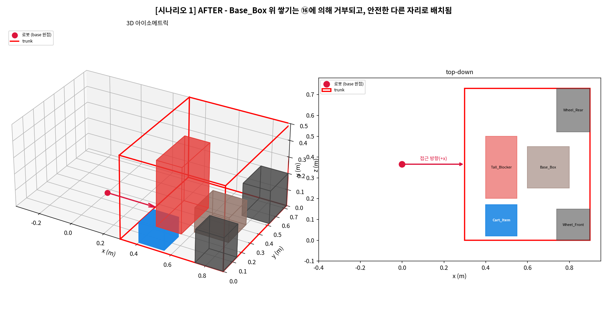

**검증**: 전체 pytest 48/48 그대로 안전 (핵심 알고리즘 미변경, 데모+공용 헬퍼만 추가).

---

## 21. 안전장치 테스트 2/4 — 3단 쌓기 체인, 그리고 실제로 발견한 버그 두 개

**계기**: 20번에 이어 두 번째 시나리오로 "카트 안에서 C가 B 위에, B가 A 위에
얹혀 있는 3단 체인"을 선정 - ⑥(픽업 순서)과 ⑮(층이 늘어날수록 빠듯해지는 천장
여유)를 같이 확인하려는 목적.

**1차 시도**: 차 바퀴가 있는 트렁크에서 실행했더니, `Chain_B`/`Chain_C`가
`Chain_A`를 거치지 않고 **차 바퀴 위**로 바로 올라가버림 - 픽업 순서(C→B→A)는
맞았지만 애초에 노리려던 "3단 탑" 상황 자체가 안 만들어짐. 차 바퀴를 빼고
트렁크를 비운 채로 재실행.

**2차 시도 - 발견 1 (알고리즘 원칙 재확인)**: 차 바퀴를 빼도 `Chain_B`와
`Chain_C`가 둘 다 `Chain_A` 위에 나란히 올라갈 뿐, `Chain_C`가 `Chain_B` 위에
쌓이진 않음. 재배치가 "카트에서 집은 순서"(C 먼저) 그대로 진행되다 보니, C가
먼저 A 위 빈자리를 차지해버리고 B는 그 옆 자리를 따로 잡는 것. **16번 라운드의
원칙("카트 안에서의 관계 ≠ 트렁크 최종 배치")이 3단 체인에서도 똑같이 재현됨** -
새 버그가 아니라 이미 확인한 특성의 연장선.

**발견 2 (진짜 데모 버그, 안전장치 자체 검증 로직이 잡아냄)**: A의 발판을
`Chain_B` 하나로 거의 꽉 차게 줄여서 진짜 탑을 강제로 만들어보려던 중,
`AssertionError: Chain_B 받침 비율 42.9% 기준 미달`가 발생. 원인 추적 결과,
재배치 코드에서 `place_one_box_stacked_only()`가 성공하면 **이미 내부적으로
`state_final`에 등록**하는데, 그 뒤에 직접 `state_final.register_placement()`를
한 번 더 호출하는 코드가 있어서 **같은 박스가 두 번 등록**됐음 - 다음 박스의
받침 비율 계산 때 그 박스의 지지 면적이 이중으로 잡혀, 실제로는 42.9%(기준
미달)인데 85.7%처럼 계산돼서 통과해버린 것. 핵심 알고리즘(`13_support_check.py`)
자체는 직접 격리해서 검증해보니 정상 - 버그는 **데모 스크립트의 재배치 루프에만**
있었음. 같은 패턴이 18번 라운드의 `sketch_placement_test_obstacles.py`에도 있었음
(그땐 재배치 대상이 하나뿐이라 증상이 안 드러났을 뿐) - 같이 수정.

```python
# local_test_data/sketch_placement_test_scenario2_three_tier_chain.py
# place_one_box_stacked_only()가 성공하면 state_final에 이미 내부에서
# register_placement()를 해버린다 - 여기서 또 register_placement를 부르면
# 같은 박스가 두 번 등록돼서, 다음 박스의 받침 비율 계산 때 그 면적이
# 이중으로 잡혀 실제로는 부족한 받침도 통과해버리는 버그가 된다.
new_plan = place_one_box_stacked_only(box, trunk, state_final, order=finalized[box.id].order)
# (수정 후) 여기서 state_final.register_placement()를 다시 호출하지 않음
```

**수정 후 최종 결과**: `Chain_A`(바닥) + `Chain_C`(그 위 2층, 100% 받침) +
`Chain_B`(받침 부족으로 쌓이지 못하고 바닥에 따로) - 물리적으로 완전히 유효한
결과. 받침 비율 재검증(⑬ 기준과 동일, 80%)도 통과.

**발견 3 (시각화 버그)**: 사용자가 "before 그림에서 박스가 쌓인 구조가 아니라
나란히 배치돼있다"고 지적 - `_viz_helpers.py`가 대기 중인(카트) 박스를 전부
바닥(z=0)에 나란히만 그리고 있었음, 카트 안에서 실제로 얹혀있는 관계를 반영 안
함. `SceneBox`에 `stack_on_id` 필드를 추가해서, 3D에서는 실제로 층으로 쌓아
그리고 top-down에서는 레벨마다 살짝 밀어서(카드 겹치듯) 보이게 수정.

**결과 이미지**: `local_test_data/sketch_scenario2_before.png` / `sketch_scenario2_after.png`

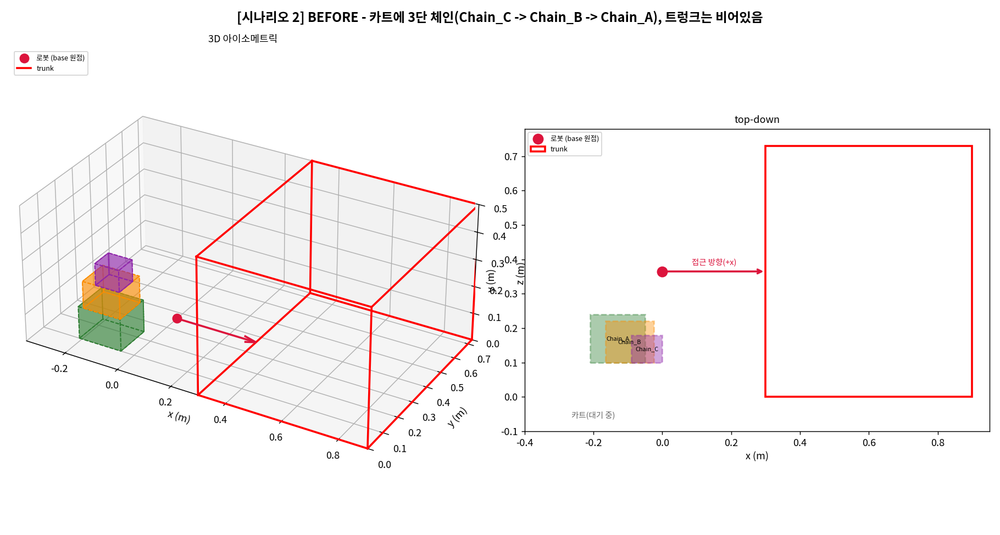
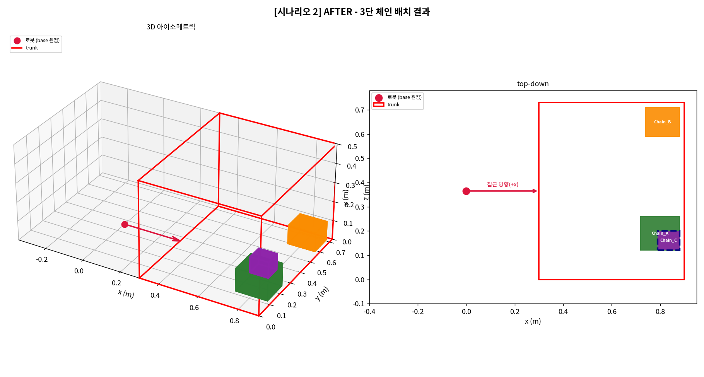

**검증**: 전체 pytest 48/48, `10_verification.py` 5/5, `12_verify_real_coords.py`
이상 없음 (버그 2건 다 데모 스크립트 안에 있었고 핵심 알고리즘은 안 건드림).

---

## 22. 안전장치 테스트 3/4 — 회전이 필요한 박스 (당시엔 아직 미지원)

**계기**: 20·21번에 이어 세 번째 시나리오로 "회전하면 들어가지만 지금은 회전을
안 하는 상황"을 선정 - 19번에서 확인한 한계를 실제 숫자로 보여주려는 목적.

**설계**: `Wide_Box`(가로 0.65m × 세로 0.30m)를 트렁크(폭 0.60m)에 배치. 정자세
그대로는 가로가 트렁크 폭보다 커서 위치와 무관하게 애초에 불가능.

**결과**: 실제 알고리즘 결과 - **미적재, 사유 `SIZE_EXCEEDS_TRUNK`** (⑧이 정확히
분류). 참고용으로 90도 돌린 치수(0.30×0.65)로 별도 시험 배치를 해보니 문제없이
들어감(x=0.14~0.44, y=0~0.65) - 회전을 지원했다면 놓칠 필요 없는 자리인데 당시엔
시도조차 안 하고 포기하는 걸 실증. (이 한계는 26번에서 실제로 해소됨 - 이 라운드의
스크립트가 그대로 26번에서 업데이트되어 재사용됨.)

**결과 이미지**: `local_test_data/sketch_scenario3_before.png` / `sketch_scenario3_after.png`
(26번에서 회전 지원 후 버전으로 다시 덮어써짐 - 이 라운드 당시 화면은 별도로
안 남아있고, 최종본은 26번 항목에서 확인 가능)

**검증**: 전체 pytest 48/48 그대로 안전 (핵심 알고리즘 미변경, 데모만 추가).

---

## 23. 안전장치 테스트 4/4 — 완전히 꽉 찬 트렁크

**계기**: 마지막 네 번째 시나리오로 "진짜로 자리가 없는" 상황을 선정 - ⑧(미적재
사유 분류)이 서로 다른 이유 세 가지를 정확히 구분하는지 한 번에 확인하려는 목적.

**설계**: 큰 장애물 2개(트렁크의 약 65%를 차지)로 남는 공간을 L자 모양의 좁은
틈만 남기고, 카트 박스 4개를 순서대로 시도:
- `Small_Fit`: L자 틈에 맞는 크기 (성공 기대)
- `Shape_Blocked`: 부피는 되는데 좁은 틈 모양에 안 맞는 크기 (`NO_VALID_CANDIDATE_POSITION` 기대)
- `Volume_Squeeze`: 자체 크기는 트렁크에 들어가지만 남은 부피 자체가 부족 (`INSUFFICIENT_REMAINING_VOLUME` 기대)
- `Too_Big_Overall`: 트렁크 폭보다 큼 (`SIZE_EXCEEDS_TRUNK` 기대)

**결과**: 첫 시도에서 의도한 그대로 정확히 나옴 - `Small_Fit` 성공, 나머지 세
박스가 각각 의도한 사유 코드로 정확히 분류됨. ⑧이 실전 복합 시나리오에서도
정확하다는 걸 확인.

**결과 이미지**: `local_test_data/sketch_scenario4_before.png` / `sketch_scenario4_after.png`

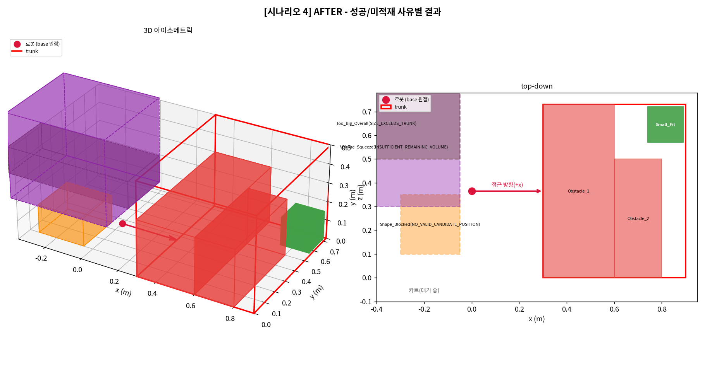

**검증**: 전체 pytest 48/48 그대로 안전.

---

## 24. 박스-벽 / 박스-박스 마진(⑰) 추가

**계기**: 사용자가 "박스끼리 아예 딱 붙지 말고 아주 조금 여유 공간을 두는 게
좋겠다"고 요청 - 그리퍼가 옆 박스/벽에 긁히지 않도록. 고정 마진 1cm, 박스-벽·
박스-박스 둘 다 적용하기로 확정.

**설계**: `17_margin_check.py` 신규 - `has_wall_margin()`(트렁크 옆벽·안쪽벽까지
x/y 방향 확인, 바닥·천장은 제외), `has_box_margin()`(z 범위가 실제로 겹치는,
즉 옆으로 나란한 박스와만 확인 - 위/아래로 쌓이는 관계는 완전히 맞닿아야
하므로 대상 아님), `has_sufficient_margin()`(둘 다).

**문제 1 - 검사만 넣으면 자리가 아예 안 나옴**: 벽/박스에 "딱 붙는" 자리를
만드는 후보 생성(`generate_wall_flush_candidates`, `generate_box_flush_candidates`)은
그대로 두고 검사만 추가하면, 모든 flush 후보가 마진 미달로 거부되어 벽 근처엔
아무 것도 못 놓게 됨. 두 생성 함수에 `margin` 파라미터를 추가해서 "벽/박스에서
마진만큼 뗀" 자리를 직접 만들도록 수정.

**문제 2 - 조합 후보 누락 (실제 발견)**: "벽에서 마진만큼 뗀 자리"가 하필
다른 박스와는 마진 미달로 너무 가까운 경우가 있는데, 그 조합("벽 마진" +
"박스 마진" 둘 다 적용)을 만드는 후보가 없어서 실제로 있는 더 깊은 자리를
못 찾는 경우를 발견 (7번·12번과 같은 클래스의 "후보 생성 완전성" 문제). 벽-플러시
결과를 다시 박스-플러시 생성기에 넣어서 조합을 만드는 방식(`combo_flush`)으로 해결.

```python
# 07_placement_plan.py
wall_flush = generate_wall_flush_candidates(box, trunk, state.candidates, margin=MARGIN)
box_flush = generate_box_flush_candidates(box, trunk, state.candidates, state.placed, margin=MARGIN)
combo_flush = generate_box_flush_candidates(box, trunk, wall_flush, state.placed, margin=MARGIN)
candidate_pool = state.candidates | wall_flush | box_flush | combo_flush
```

**문제 3 - 검증 도구 자체의 기존 버그 발견**: 실제 스캔 데이터로 돌렸을 때
"Medium이 진짜 있는데 못 찾은 것처럼" 나와서 조사해보니, `12_verify_real_coords.py`의
브루트포스 교차검증기가 **이미 배치된 다른 카트 박스(Large)를 빼먹고** 원래
스캔 장애물만으로 자리를 세고 있었음 - 마진과 무관한, 원래부터 있던 버그.
픽업 순서대로 "실패한 박스보다 먼저 성공한 박스들"까지 포함하도록 고쳤더니
"진짜로 자리 없음"으로 알고리즘 판단과 정확히 일치.

**회귀 대응**: 여러 테스트가 "박스가 트렁크/다른 박스에 정확히 딱 맞음(슬랙 0)"을
전제로 하고 있었는데, 마진 도입으로 슬랙이 최소 2×MARGIN은 있어야 성립하게
바뀌어서 트렁크·박스 치수를 마진만큼 넉넉하게 재설계 (`10_verification.py`의
Blocker 깊이 0.35→0.33 등).

**검증**: TDD 11케이스(`tests/test_17_margin_check.py`), 전체 pytest 59/59,
`10_verification.py` 5/5, `12_verify_real_coords.py` 이상 없음(수정된 브루트포스
기준으로 "진짜로 자리 없음" 정확히 일치).

---

## 25. 마진 실측 데모

**계기**: 24번 구현 직후, 실제 적재 결과에 마진이 적용되는지 눈으로/숫자로
확인하고 싶다는 요청 - 다섯 번째 시나리오로 추가.

**설계**: 장애물 없는 빈 트렁크에 박스 4개(Box_A~D)를 부피 큰 순으로 순서대로
배치하고, 벽까지 거리·박스끼리 거리를 전부 직접 계산해서 콘솔에 cm 단위로 출력
(그림에서 1cm는 눈으로 구분하기엔 너무 작아서).

**결과**: 4/4 배치 성공, **모든 벽 간격·박스 간격이 1cm 이상** - 특히 여러
쌍(`Box_A~Box_B`, `Box_C~Box_D`, 벽 쪽 다수)이 정확히 1.00cm 경계값에 걸려있어서,
마진이 느슨하게 지켜지는 게 아니라 최소치로 빡빡하게 지켜지고 있다는 것까지 확인.

**결과 이미지**: `local_test_data/sketch_scenario5_before.png` / `sketch_scenario5_after.png`

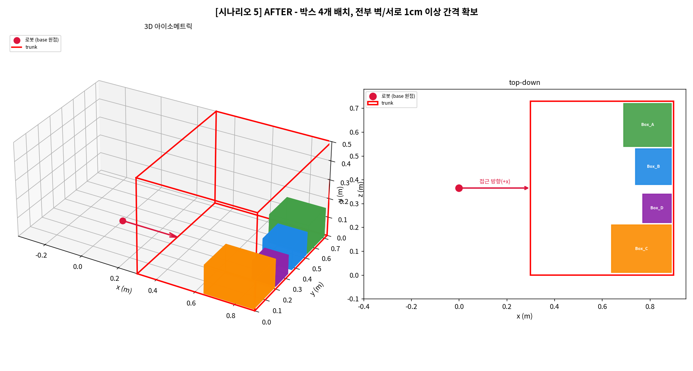

**검증**: 전체 pytest 59/59 그대로 안전.

---

## 26. 회전(⑱) 자동 적용

**계기**: 마진(24·25번) 완료 직후, "회전시키는 알고리즘도 추가하자"는 요청.
단, 로봇 그리퍼 특성상 박스를 눕히거나 뒤집는 건 불가능하고 **z축 기준으로
돌리는 것(가로/세로 교환)만** 가능하다는 제약을 명확히 받음.

**설계**: `18_rotation.py` 신규 - `rotate_box()`(가로/세로만 교환, 높이는 절대
안 바뀜), `fits_dims_any_rotation()`(⑧의 SIZE_EXCEEDS_TRUNK 판단용, 회전
감안해서 트렁크 자체 크기를 넘는지 확인). `07_placement_plan.py`의
`place_one_box()`는 **정자세를 먼저 시도**하고, 그래도 자리가 없을 때만 90도
돌린 자세로 재시도(불필요한 그리퍼 동작을 피하려고 정자세가 되면 안 돌림).
`PlacementPlan`에 `rotated` 필드 추가. `08_unloadable_reason.py`도 회전
감안하도록 수정 - 안 그러면 돌리면 들어가는 박스를 "재배치해도 소용없음"으로
잘못 분류할 위험이 있었음.

**실제 데이터로 확인된 개선**: `run_20260720_200104`에서 그동안 미적재
(`NO_VALID_CANDIDATE_POSITION`)였던 `Medium` 박스가 이제 회전(0.4×0.3 →
0.3×0.4)으로 정상 배치됨 - 실측 run 2건 모두 미적재 0건 달성.

**부수 발견 - 24번 마진 동기화 때 빠뜨린 버그**: 데모 스크립트 5개의 로컬
재구현에 회전을 동기화하던 중, 애초에 마진 동기화 때 `margin=MARGIN` 파라미터와
`combo_flush` 조합을 빠뜨렸던 걸 발견 (필터만 걸고 후보 생성은 그대로 뒀던 것) -
같이 고쳤더니 `near_full` 데모가 4/5(마진 도입 후 줄었던 상태)에서 5/5로
회복됨, 진짜 개선임을 확인.

**시나리오 3 업데이트**: 22번에서 만든 "회전 필요한 박스" 데모를, 이제 실제로
`place_one_box()` 한 번 호출만으로 자동 배치 성공하도록 갱신 - 예전엔 미적재
확인 + 참고용 별도 시험이 필요했는데, 지금은 그 과정 자체가 필요 없어짐.

**결과 이미지 (22번 시나리오의 최종 갱신본)**: `local_test_data/sketch_scenario3_before.png` / `sketch_scenario3_after.png`

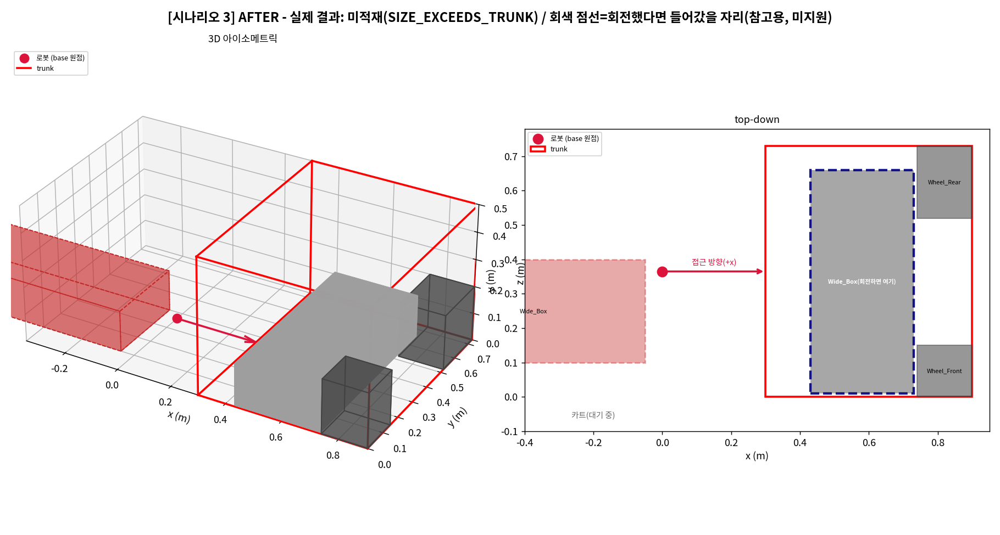

**검증**: TDD 7케이스(`tests/test_18_rotation.py`), 전체 pytest 66/66,
`10_verification.py` 5/5, `12_verify_real_coords.py` 실측 2건 모두 미적재 0건.

---

## 파일별 최종 변경 요약

| 파일 | 상태 | 이번 반복에서 추가/변경된 것 |
|---|---|---|
| `01_object3d_schema.py` | 기존 파일 수정 | `load_boxes_from_vision_json()`, `EXPECTED_BOX_FRAME`, `Object3D.rests_on_id` |
| `02_trunk_space_state.py` | 기존 파일 수정 | `Trunk.entrance_near_x`, `to_bounding_trunk()`의 입구 방향 추정 |
| `03_extreme_point_candidates.py` | 기존 파일 수정 | `generate_wall_flush_candidates()`, `generate_box_flush_candidates()`, `Box.rests_on_id` |
| `04_candidate_validity_check.py` | 기존 파일 수정 | `is_candidate_valid()` 하한 경계(x<0 등) 검사 추가 |
| `05_candidate_scoring.py` | 기존 파일 수정 | `entrance_distance_ratio()`, `side_wall_distance_ratio()`, `WALL_A_WEIGHT`, `WALL_BC_WEIGHT` |
| `06_loading_order_decision.py` | 기존 파일 수정 | `decide_loading_order()` 위상정렬 재작성 (픽업 순서 제약) |
| `07_placement_plan.py` | 기존 파일 수정 | `generate_wall_flush_candidates()` + `generate_box_flush_candidates()`(마진 포함) + `has_overhead_clearance()` + `has_clear_approach_path()` + `has_sufficient_margin()` 연결, 회전(⑱) 폴백, `PlacementPlan.rotated` |
| `08_unloadable_reason.py` | 기존 파일 수정 | `classify_unloadable_reason()`이 `fits_dims_any_rotation()` 사용하도록 수정 |
| `13_support_check.py` | 신규 | 받침 확인 전체 |
| `14_run_full_pipeline.py` | 신규 | 지완 실사용 CLI 진입점 |
| `15_overhead_clearance_check.py` | 신규 | 상단 여유 공간(⑮) 확인 + 접근 경로 확인(⑯, `has_clear_approach_path`) |
| `17_margin_check.py` | 신규 | 박스-벽/박스-박스 최소 간격(⑰) 확인 |
| `18_rotation.py` | 신규 | 회전(⑱) 지원 - `rotate_box()`, `fits_dims_any_rotation()` |
| `local_test_data/*.py` | 신규/수정 (13개 스크립트) | 손그림 시나리오 재현 + 시각화 + 인터랙티브 3D 편집기 + 안전장치 테스트 시나리오 5개 |
| `local_test_data/_viz_helpers.py` | 신규 | 여러 스크립트가 복붙하던 3D+top-down 시각화 공용 헬퍼 (비포/애프터 쌍 생성) |
| `local_test_data/*.png` | 신규/수정 (19개 이미지) | 각 라운드/시나리오 결과 시각화 |

## 테스트 현황

- 최종 pytest: **66/66 통과** (`tests/` 디렉터리, ⑰ 11케이스 + ⑱ 7케이스 포함)
- `10_verification.py`: 5/5 통과
- `12_verify_real_coords.py`: 실제 스캔 데이터(`run_20260720_160153`, `run_20260720_200104`) 2개 run **미적재 0건** (⑱ 도입 전엔 한 run에서 Medium 1건 미적재였음), 브루트포스 교차검증 통과 (검증기 자체의 기존 버그도 24번에서 발견·수정함)
- `local_test_data/sketch_placement_test_obstacles.py`, `sketch_placement_test_scenario2_three_tier_chain.py`: 받침 비율(⑬ 기준, ≥80%) 자체 재검증 통과

## 확인된 한계 (코드 미변경, 알고 있는 채로 보류)

- **장애물 위 적층**: 받침 확인 로직이 "다른 박스"와 "차 바퀴 같은 장애물"을 구분 안 해서, 실제로는 둥글어서 평평하게 못 얹을 장애물 위에도 쌓일 수 있음 (9번에서 발견, 아직 미수정).
- **VGP20 그리퍼 실측 없음**: `OVERHEAD_CLEARANCE=0.20`은 실제 그리퍼 CAD가 아니라 보수적 추정치 (13번).
- **비전 `support_candidate_id` 매핑 미확정**: `rests_on_id`를 실제 비전 필드와 정확히 매핑하는 건 팀 확인 전이라 로더는 항상 `None`으로 둠 (14번).
- **카트에서의 적재 구조(탑 모양)를 트렁크에서 그대로 재현 안 함**: 재배치가 "카트에서 집은 순서"대로 진행되다 보니, 먼저 집힌 작은 박스가 큰 발판을 먼저 차지해버려서 뒤에 집힌 박스가 원래 노렸던 자리에 못 쌓이고 밀려날 수 있음 (16번에서 2단으로 처음 확인, 21번에서 3단 체인으로 재확인). 진짜 탑을 재현하려면 재배치 순서 로직 자체를 바꿔야 함 - 아직 미착수.
- **슬라이드인 적재(미착수)**: "2층 박스를 입구에서 걸쳐두고 밀어 넣는" 아이디어는 논의만 하고 설계는 아직 시작 안 함.

> ✅ **회전 미지원 한계는 26번(⑱)에서 해소됨** - 정자세로 안 들어가면 자동으로
> 90도 돌려서(가로/세로 교환만, 눕히기/뒤집기는 로봇 특성상 여전히 불가) 재시도한다.
